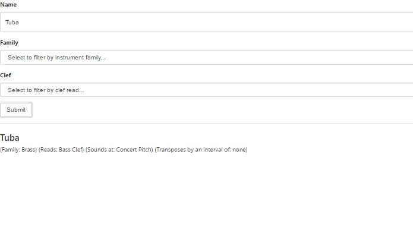
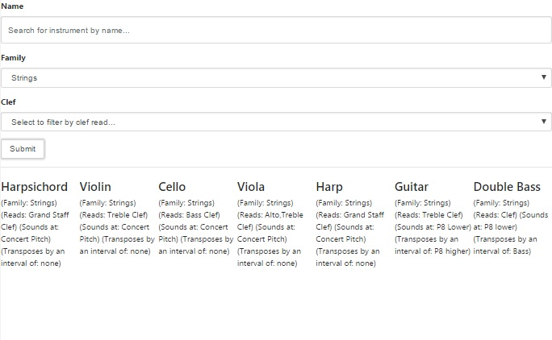
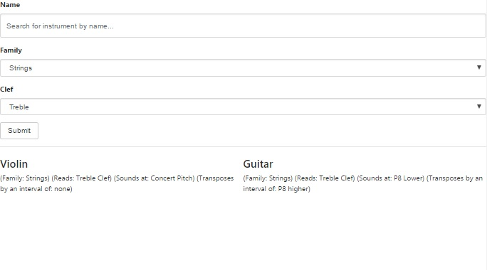

# Instrument-Search

  A single page web application built with React, Node, and PostgreSQL. 

## Introduction

  Checkout a live demo of the app's main search feature:
  https://orchestral-instrument-database.herokuapp.com

## Description
*Get information about a single instrument.  

*Get information about a group of instruments.
  *For example, all of the instruments in the strings family...
  
  
*Filtering by multiple fields.
  *For example, all of the instruments that are in the strings family AND read treble clef...

## Technologies Used
 
### React.js
* Front-end  
* Main Search UI    
* Admin UI  

### Node.js  
* Simple server with API that gives back JSON to client side requests

#### API

##### REST Routes

###### Search Route
*`GET /api/search`
  * `?name=$name`
  * `?family=$family`
  * `?clef=$clef`

###### Instrument Routes 
* return an object with all possible values relative the endpoint
  * `GET /api/family`
  * `GET /api/clefs`
  * `GET /api/sounds`
  * `GET /api/transposes`

###### Admin Routes
* `POST /instrument/update`
* `GET /instrument/create`
* `GET /instrument/delete`

### PostgreSQL  
* Database

## License
